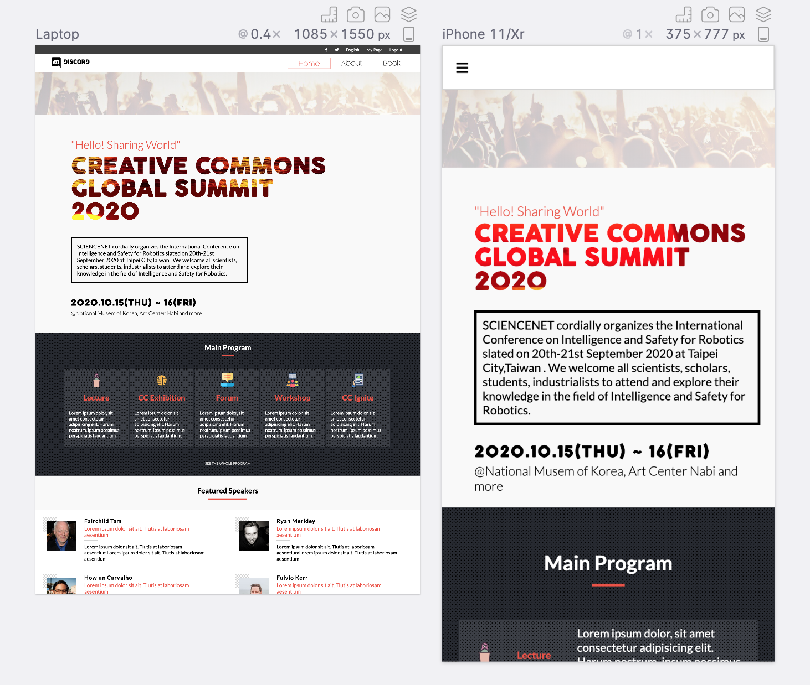
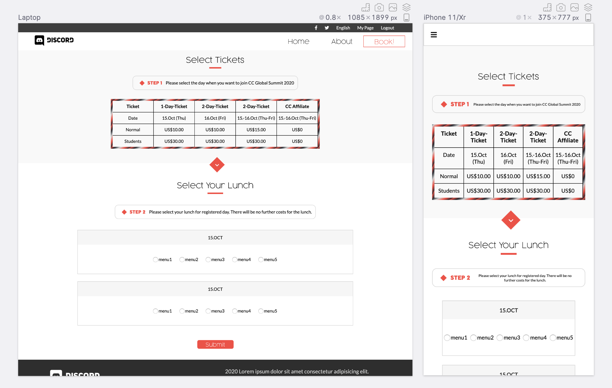

# capstone project:  Global Summit 2020

  
  
> This is the HTML/CSS capstone project for Microverse program.

> An online website for a conference.

  
  

  

## Built With :

  

-  **Html**

-  **CSS**  ( fexbox, grid )
- **SASS** 

## Demo Link:

[You can find the project live here](https://raw.githack.com/elasfarc/capstone-project--Global-Summit-2020/feature-branch/index.html)

  

## Authors

  

👤  Mohammed Al-Asfar
       [Github](https://github.com/elasfarc)

## 🤝 Contributing

Contributions, issues and feature requests are welcome!

## Show your support ⭐️

Give a ⭐️ if you like this project!

  

## Acknowledgments

**Cindy Shin** 
[Design](https://www.behance.net/adagio07)